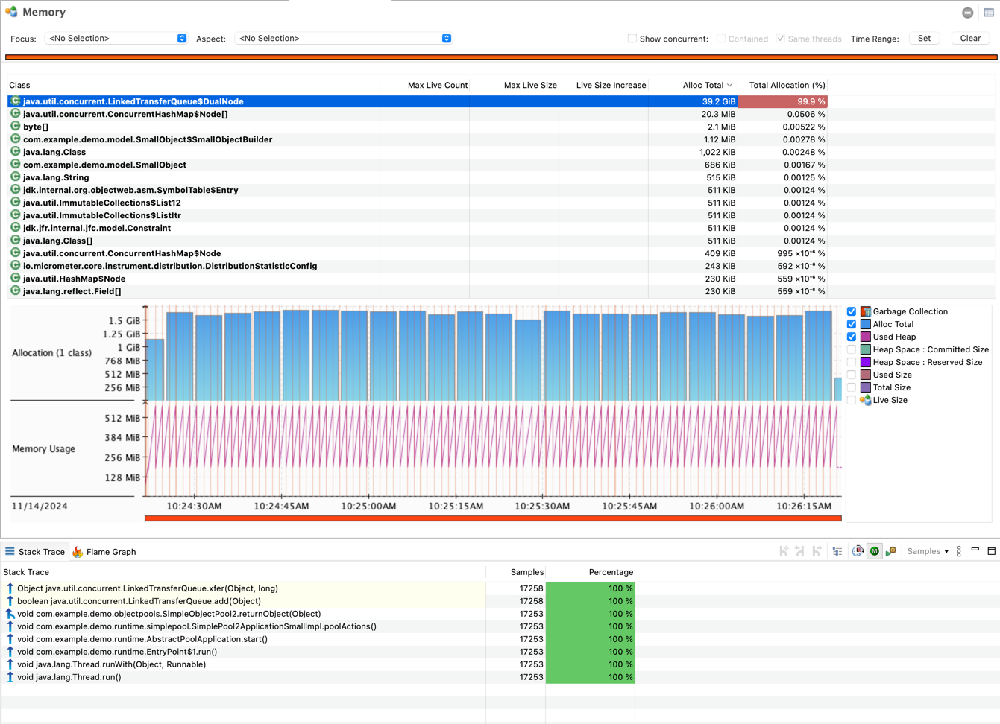
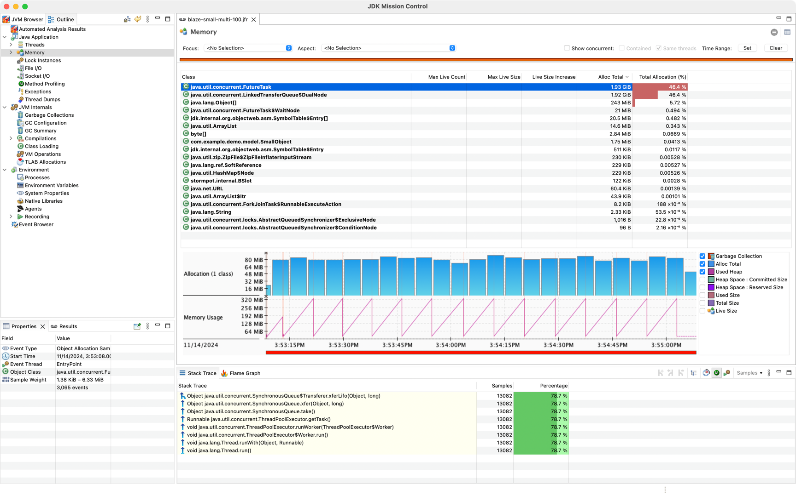

# Performance Benchmark on Object Pool

## ConcurrentLinkedQueue

Can't directly use for Object Pool.

given it creates Node Object every time on return Object to Object Pool.
which cause huge amount of memory allocation. as following image showing.

## LinkedTransferQueue

### reference implementation on Storm BlazePool (https://github.com/chrisvest/stormpot)

### Can't directly use LinkedTransferQueue as following image showing.

## Storm BlazePool

* unbound
* cache borrowed Object in Local Thread
* not perform well in virtual thread.

## In Concurrent

### Virtual Thread 

### Executors

